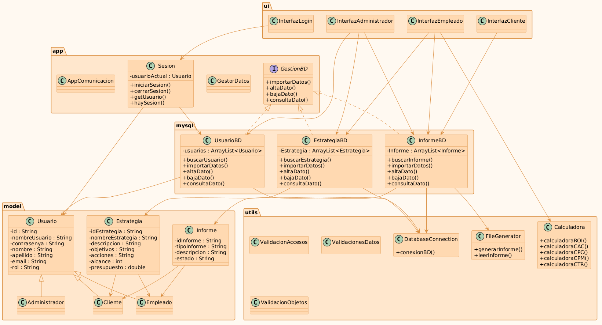
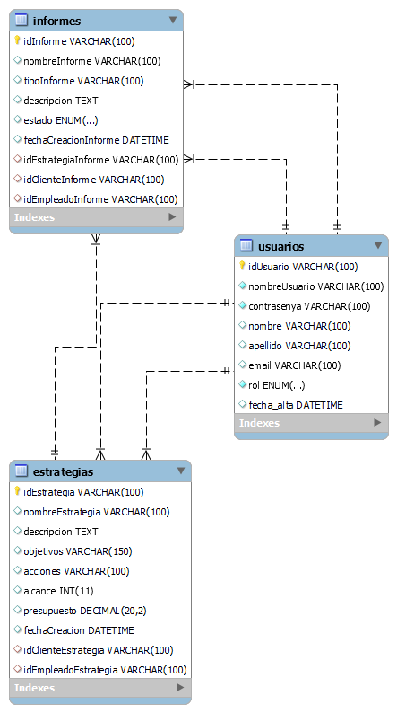
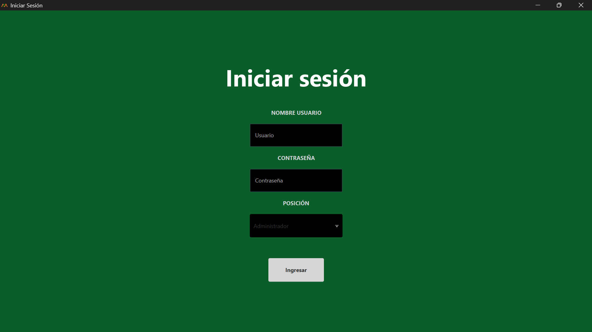
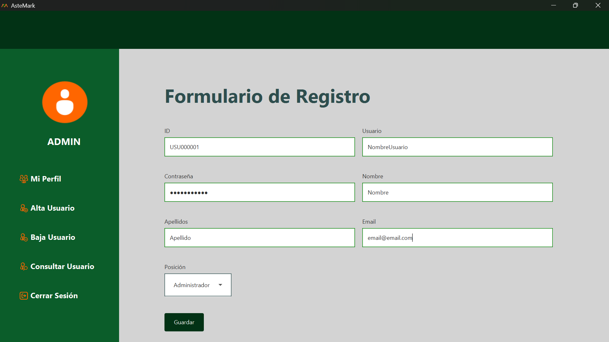
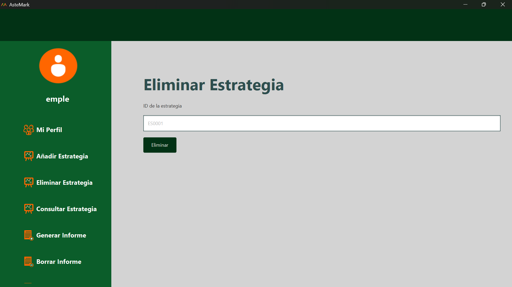
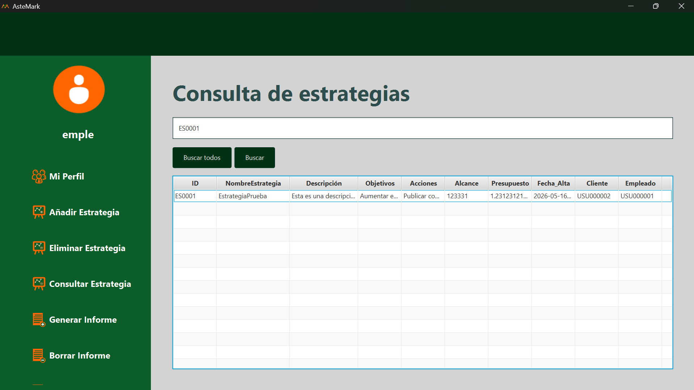
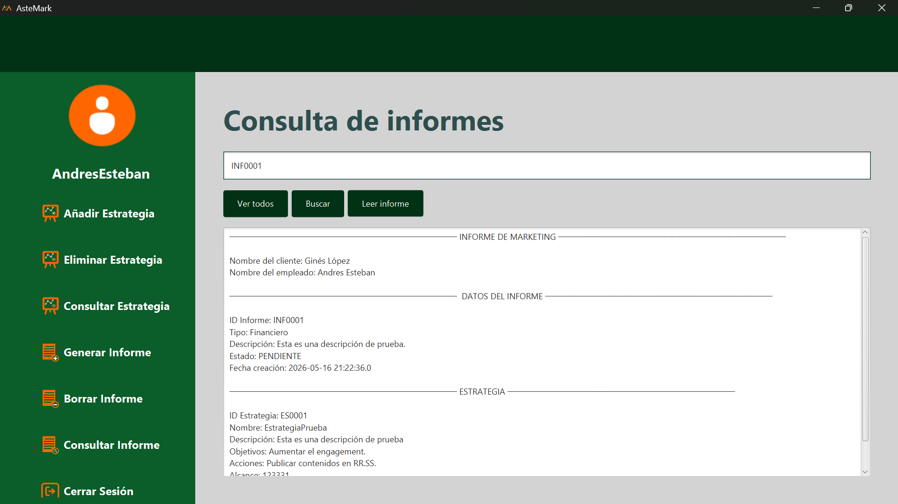
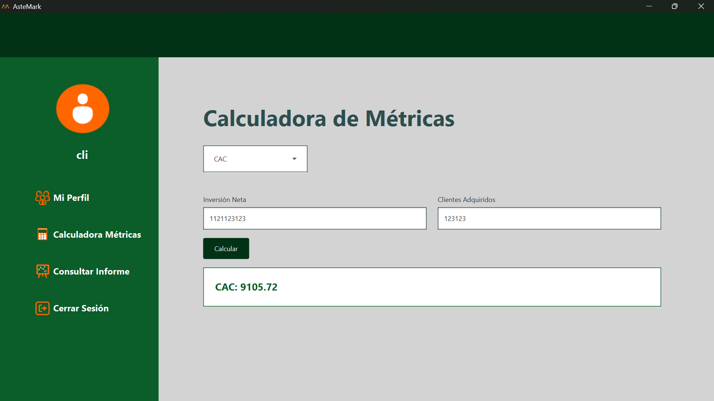

# ASTEMARK


# Introducción ##

Este proyecto consiste en un sistema gestor orientado a empresas de comunicación. La aplicación permite organizar y gestionar distintos elementos importantes dentro de una empresa, facilitando el control de usuarios, estrategias e informes desde un único sistema.

El objetivo principal es mejorar la organización de la información y permitir una gestión más cómoda de las tareas relacionadas con campañas, documentación e interacción entre empleados y clientes.

# Funcionalidades

La aplicación ofrece distintas funcionalidades orientadas a facilitar la gestión interna de una empresa de comunicación. El sistema permite administrar usuarios, organizar estrategias y consultar información de forma centralizada, diferenciando además las opciones disponibles según el tipo de usuario que accede a la aplicación.

- Gestión de usuarios con distintos roles.
- Inicio y cierre de sesión.
- Consulta de información de perfiles.
- Creación y gestión de estrategias de comunicación.
- Generación y consulta de informes.
- Organización centralizada de la información.
- Control de acceso según el tipo de usuario.

Estas funcionalidades permiten centralizar gran parte de las tareas habituales dentro de una empresa de comunicación, facilitando el acceso a la información y mejorando la organización interna. Gracias a la diferenciación de roles y a la gestión estructurada de los datos, el sistema ofrece un entorno más seguro, ordenado y eficiente para empleados, administradores y clientes.

# Estructura de paquetes

El proyecto se ha organizado en distintos paquetes para separar responsabilidades y mantener una estructura clara y ordenada.

El paquete app contiene las clases principales relacionadas con el funcionamiento general de la aplicación, como el inicio del programa y la gestión de sesiones.

En model se encuentran las clases del dominio, que representan las entidades principales del sistema, como usuarios, estrategias e informes.

El paquete mysql agrupa las clases encargadas de gestionar la persistencia y las operaciones con la base de datos.

Dentro de resources se almacenan los recursos visuales utilizados por la aplicación, como hojas de estilo CSS e imágenes.

El paquete ui contiene todas las interfaces gráficas desarrolladas con JavaFX, diferenciadas según el tipo de usuario.

Por último, utils incluye clases auxiliares utilizadas en distintas partes del proyecto, como validaciones, cálculos, generación de archivos y conexión con la base de datos.

Esta organización permite mantener el código modular, facilitar el mantenimiento y mejorar la escalabilidad del proyecto.

```text
src/
├── 📁 app/
│   ├── ☕ AppComunicacion.java
│   ├── ☕ GestionBD.java
│   ├── ☕ GestorDatos.java
│   └── ☕ Sesion.java
├── 📁 model/
│   ├── ☕ Administrador.java
│   ├── ☕ Cliente.java
│   ├── ☕ Empleado.java
│   ├── ☕ Estrategia.java
│   ├── ☕ Informe.java
│   └── ☕ Usuario.java
├── 📁 mysql/
│   ├── ☕ EstrategiaBD.java
│   ├── ☕ InformeBD.java
│   └── ☕ UsuarioBD.java
├── 📁 resources/
│   ├── 📁 css/
│   │   └── 🎨 estilos.css
│   └── 📁 img/
│   │   └── 🖼️ Todas_las_imagenes.png
├── 📁 ui/
│   ├── ☕ InterfazAdministrador.java
│   ├── ☕ InterfazCliente.java
│   ├── ☕ InterfazEmpleado.java
│   └── ☕ InterfazLogin.java
└── 📁 utils/
│   ├── ☕ Calculadora.java
│   ├── ☕ DatabaseConnection.java
│   ├── ☕ FileGenerator.java
│   ├── ☕ ValidacionAccesos.java
│   ├── ☕ ValidacionesDatos.java
│   └── ☕ ValidacionObjetos.java

```

Además, esta separación en paquetes facilita futuras ampliaciones del proyecto, permitiendo incorporar nuevas funcionalidades sin afectar al resto del sistema. La estructura modular también mejora la legibilidad del código y simplifica tanto las tareas de depuración como el trabajo colaborativo entre desarrolladores.

# Estructura de clases

A continuación se muestra el diagrama de clases del proyecto, donde se representan las principales entidades del sistema y las relaciones existentes entre ellas. Este diagrama permite comprender de forma visual la organización interna de la aplicación y la interacción entre sus diferentes componentes.



# Estructura de la base de datos

A continuación se muestra el diagrama de la base de datos utilizado en el proyecto. En él se representan las diferentes tablas que componen el sistema, así como las relaciones existentes entre ellas.

Este diseño permite organizar la información de forma estructurada y mantener la integridad de los datos relacionados con usuarios, estrategias, informes y demás elementos gestionados por la aplicación.




# Cómo ejecutar el proyecto

Para ejecutar correctamente la aplicación es necesario tener instalado Java y MySQL.

### 1. Clonar el repositorio
Ejecutar el siguiente comando en la terminal del ordenador:

```bash
git clone https://github.com/andres-esteban-perez/Astemark_Software.git
```

### 2. Configuración de la base de datos

Antes de ejecutar el proyecto es necesario:

- Tener MySQL Server instalado.
- Ejecutar el script SQL incluido en el proyecto para crear la base de datos y las tablas.
- Configurar los datos de conexión (usuario, contraseña y url) en:

```bash
utils/DatabaseConnection.java
```
### 3. Tipos de ejecución

### Ejecutar desde del IDE

El proyecto puede ejecutarse desde cualquier entorno de desarrollo compatible con Java, como IntelliJ IDEA, Eclipse o Visual Studio Code. Aunque algunos pasos pueden variar ligeramente dependiendo del IDE utilizado, el proceso general es similar.

Pasos generales:

- Abrir el proyecto desde el IDE.
- Esperar a que se carguen las dependencias y recursos.
- Configurar el JDK de Java si es necesario.
- Buscar la clase principal del proyecto:

```bash
AppComunicacion.java
```
- Ejecutar la aplicación utilizando la opción “Run” o “Ejecutar” del entorno de desarrollo.


Una vez iniciada, si no ocurre ningún problema,  aparecerá la pantalla de inicio de sesión de la aplicació.

### Ejecutar desde terminal
La aplicación también puede ejecutarse directamente desde la terminal del sistema operativo sin necesidad de utilizar un IDE.

Para ello, primero es necesario abrir la terminal del ordenador. En Windows puede hacerse buscando “CMD”, “Símbolo del sistema” o “PowerShell” en el menú de inicio. En otros sistemas operativos como Linux o macOS también existe una aplicación de terminal equivalente.

Una vez abierta la terminal, es necesario desplazarse hasta la carpeta donde se encuentra el proyecto.

#### Comandos básicos de navegación

#### Mostrar el contenido de una carpeta

```bash
dir
```
#### Entrar en una carpeta

```bash
cd nombreCarpeta
```

#### Volver a la carpeta anterior

```bash
cd ..
```
Una vez situados en la carpeta raíz del proyecto, se debe compilar el código fuente con el siguiente comando:

#### Ejecución

Este comando utiliza el compilador de Java (javac) para transformar todos los archivos .java del proyecto en archivos compilados .class. La opción -d bin indica que dichos archivos compilados se almacenarán dentro de la carpeta bin.

```bash
javac -d bin src/**/*.java
```

Este comando ejecuta la aplicación Java utilizando la carpeta bin como ubicación de las clases compiladas. Finalmente, app.AppComunicacion indica la clase principal que contiene el método main encargado de iniciar el programa.

```bash
java -cp bin app.AppComunicacion
```

Al ejecutar el comando aparecerá la pantalla de inicio de sesión de la aplicación.

### 4. Requisitos

- Java JDK 17 o superior.
- MySQL Server.
- JavaFX configurado correctamente.

Cumpliendo estos requisitos y siguiendo los pasos anteriores, la aplicación podrá ejecutarse correctamente tanto desde un entorno de desarrollo como desde la terminal del sistema operativo. Esto permite trabajar con el proyecto de forma flexible según las preferencias o necesidades del usuario.

# Manual de uso

En este apartado se describen las principales acciones que pueden realizarse dentro de la aplicación. A través de diferentes interfaces gráficas, el usuario podrá gestionar información, consultar datos y utilizar las herramientas disponibles según el rol asignado dentro del sistema.

## Inicio de sesión

Al iniciar la aplicación se muestra una pantalla de autenticación donde el usuario debe introducir sus credenciales y seleccionar el tipo de usuario correspondiente.



---

## Alta de datos

La aplicación permite registrar nuevos elementos dentro del sistema mediante formularios interactivos. Dependiendo del rol del usuario podrán añadirse usuarios, estrategias o informes.

Para realizar un alta, el usuario debe completar los campos solicitados en el formulario y pulsar el botón **Guardar** para almacenar la información en la base de datos.



---

## Baja de datos

El sistema permite eliminar información almacenada introduciendo el identificador correspondiente del elemento que se desea borrar.



---

## Consulta de datos

Los usuarios pueden realizar búsquedas utilizando identificadores o nombres concretos para consultar la información almacenada en la base de datos.

El usuario debe introducir el identificador en el cuadro de búsqueda y pulsar el botón **Buscar** para visualizar los resultados. También puede consultar toda la lista de un elemento pulsando directamente el botón **Buscar todo**.



---

## Visualización de informes

La aplicación incorpora un visor de informes que permite cargar y mostrar documentos generados previamente desde la propia interfaz gráfica.

El usuario debe introducir el identificador del informe para poder leerlo y pulsar el botón **Leer Informe**.



---

## Calculadora de métricas

El sistema incluye una calculadora de métricas de marketing que permite obtener indicadores como ROI, CPC, CPM o CTR introduciendo los datos necesarios en formularios específicos.

El usuario debe introducir los números que requiere la métrica y darle al botón **Calcular**. 



# AUTOR

- [Andrés Esteban](https://github.com/andres-esteban-perez/Astemark_Software.git)


